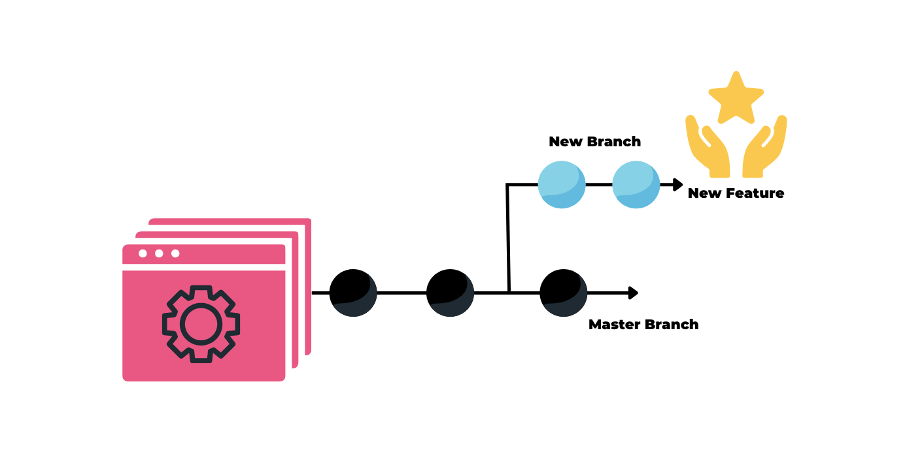

# DevOps Engineer: 30+ Interview Questions and Answers

[https://mp.weixin.qq.com/s/ZJm_dVF4T7CLLtZre_UcMg](https://mp.weixin.qq.com/s/ZJm_dVF4T7CLLtZre_UcMg)

**1. How much do you know about DevOps?**

The words "Developer" and "Operator" are combined to form the term "DevOps".

Developers and Operators are two separate teams working together to get the app ready.

The people who develop the application are called "developers", and the operators set up and operate the application on the server. 

In previous years, not many updates were required after the application was created and launched. Everyone's happy these days because it's going to take too long to update and adjust software to accommodate changes. Development and operations thus diverge. However, modern apps have been constantly updated in recent years. Newer redundancy required the development of a new process culture, giving rise to DevOps.

By coordinating and orchestrating software development and IT operations, businesses can design and deliver applications and services using a set of adaptive practices and processes known as DevOps.

**2. What is the difference between DevOps and Agile methodologies?**

A DevOps culture fosters collaboration between development and operations workgroups. **Therefore, software is continuously developed, tested, integrated, deployed and monitored throughout its life cycle.** DevOps resolves issues and disagreements between IT operations and developers.

Agile is a software development methodology that **emphasizes customer feedback and iterative, incremental, small and rapid software releases**. It resolves disagreements and disputes between clients and developers.

**3. Which DevOps tools are most widely used?**

The most common DevOps tools are:

* Saltstack
* Puppet
* Chef
* Git
* Jenkins
* Ansible
* Docker
* SonarQube
* Nexus/Artifactory
* Harbor
* Kubernetes
* Maven/Gradle

**4. How many stages are there in DevOps?**

The DevOps lifecycle has eight phases:

* **Planning**: A detailed application type plan is required to fully understand the development process.
* **Code**: The program is coded according to the requirements of the end user.
* **Build**: Create the application by merging the code generated by the previous stages.
* **Testing**: This is the most important stage in the application creation process. Check the functionality of the application and rewrite it if something goes wrong.
* **Integration**: Multiple codes from different programmers are combined into one code.
* **Deployment**: Publishing code in the cloud for use by other users. New updates are thoroughly checked to make sure they don't break high-traffic sites.
* **Action**: Manipulate the code if necessary.
* **Monitoring**: The running of the application is always monitored. The needs of the final consumer are prioritized and adjusted accordingly.

**5. Describe some of the main benefits of DevOps**

**The main benefits of DevOps are:**

* Continuous delivery of software
* Fewer complex issues to deal with
* Identify defects earlier and fix them faster
* Deliver features faster
* reliable working conditions
* Enhance teamwork and communication

**6. What is Continuous Integration (CI)?**

Developers code and then combine their code into the master repository using a continuous integration (CI) approach. 

Every integration is checked through an automated build process, enabling teams to find bugs in code faster than after release.

7. What is the difference between Continuous Delivery and Continuous Deployment?

**Continuous Delivery** 

* Make sure your code is safe to put into production.
* Guarantees the intended functionality of applications and services
* * Deliver every modification to a production-like environment with rigorous automated testing 

**Continuous Deployment**
 
* Every update that succeeds in automated testing is automatically deployed to production.
* Improve the speed and reliability of software development and release.
* In the absence of such public developer buy-in, monitoring practices are always in place.

**8. What role does AWS play in DevOps?**

AWS plays the following roles in DevOps:

* **Flexible Services:** Provides elastic, fully provisioned services with no software to install or configure.
* **Built to scale**: AWS services support scaling from a single instance to multiple instances.
* **Automation**: Automate tasks and processes with AWS, giving you more time to innovate.
* **Security**: AWS Identity and Access Management (IAM) supports configuring user permissions and policies.
* **Huge partner ecosystem**: AWS offers a sizable technology platform that can integrate and extend the functionality of AWS services.

**9. What is version control?**

Version control, often called source code control, is the act of monitoring and controlling modifications to software code.

With version control, you can:

* Restores the state of the file to its previous state.
* Reverts the entire state of the project to its previous state.
* Compare evolution over time.
* Check who last changed something that could be problematic.
* Who and when initiated the issue?

**10.使用版本控制有什么好处？**

I suggest you list the benefits of version control as follows:

* A version control system (VCS) enables all team members to work on each file independently at any time. You can later use VCS to merge all the changes into one release.
* VCS neatly organizes all previous iterations and variants. You can request any version whenever you need it, giving you instant access to screenshots of your entire project.
* Every time you save an updated version of your project, your VCS asks you to enter a short summary of the changes you made. Additionally, you can view the contents of the file to determine what changes have been made. From this you can determine who changed the content of the project.
* If the central server goes down, you can use any team member's local Git repository because a distributed VCS like Git gives all team members access to the entire project history.

**11. What is the function of SSH?**

Secure Shell (or SSH) is a command-line management protocol that enables users to connect to and control remote servers over a network.

The secure encrypted SSH protocol replaces the previously popular and insecure Telnet. By doing this, you can ensure that communication with the remote server is encrypted.

**12.How to push files from local computer to GitHub repository using Git?**

* Step 1: Link the local repository to the remote repository: `git remote add origin [web addr.]`
	* (Example: `git remote add https://github.com/file.git`)
* Step 2: Push the files to the remote repository: `git push origin master`

**13.Describe the Git branching concept.**

Imagine you are working on an application and plan to add new features to it. New features can be built on new branches that you create.

* The default working branch is always the master branch.
* Different branch commits are indicated by circles on the branches.
* Once you've made all your changes, you can merge them into the master branch.

**14. What are the three most important KPIs for DevOps?**

**A few DevOps KPIs are listed below:**

* Reduces the time required to recover from failures on average.
* Increase the frequency of deployments.
* Reduce deployment failure rate.

**15. How does Ansible work?**

There are two different categories of servers in Ansible:

* **Control the machine**
* **node**

Ansible must be installed on the control computer to manage nodes using SSH. The manifest of the control machine will specify and configure the location of the nodes.

**Due to the agentless nature of Ansible, no installation is required on the server hosting the remote nodes.** Therefore, there is no need to run any background processes while managing remote nodes.

**With Ansible Playbook and SSH connections, Ansible can control multiple nodes from a single system**. Playbooks can perform various tasks and are in YAML format.

**16. What is Continuous Testing (CT)?**

Continuous testing (CT) is a DevOps phase that requires running automated test cases, which are components of an automated software delivery pipeline. This is a way to receive immediate feedback on the performance of the code being developed and the validation of any business risks.

CT is the DevOps step that consists of executing automated test cases as part of the pipeline in order to receive quick feedback on the quality and validation of company risks associated with automatically generated code.

By using this stage, the team will be able to continuously test each build (once the developed code is pushed), giving the development team the opportunity to receive immediate feedback on their work, and preventing these issues from recurring later in the SDLC.

Doing so will significantly speed up a developer's workflow for developing a project by eliminating the manual involvement steps required to rebuild the project and execute automated tests every time a change occurs.

**17. Can you differentiate between continuous testing and automated testing?**

Here are the differences:

**continuous testing** 

* All automated test cases are run through this process as part of the delivery process. 
* This process replaces manual testing by helping developers create test cases that can be executed repeatedly without manual involvement.

**automated testing**

* This process focuses on the business risks associated with the earliest possible software releases. 
* Using a set of pass/fail positions as a guide, this process enables developers to determine whether the functionality they create is bug-free.

18. Explain the master-slave architecture of Jenkins.

* Every time code is committed, the Jenkins master retrieves the updated code from the remote GitHub repository.
* It spreads the workload across all Jenkins slaves.
* **The slave executes, builds, tests and generates test reports as instructed by the Jenkins master**.

**19. What are the key concepts in a Jenkins pipeline?**

* **Pipeline**: A CD pipeline is a user-defined model. The pipeline's code specifies how the application is built, tested, and delivered.
*  **Agent**: It is a component of the Jenkins environment that can run pipelines.
*  **Steps**: Indicates a single task that Jenkins executes when triggered.
*  **Stage**: Identifies a theoretically independent set of tasks performed throughout the pipeline (build, test, deploy stages)

**20. Describe some basic Git commands.**

The table below summarizes some basic Git commands.

*  starts a new repository `git init` 
* Set the user's username and email address.
	* `git config`
	* `git config --global user.name“[name]”`
	* `git config --global user.email“[email]”`
* Generate a local copy of the repository.
	* `git clone <repository path>`
* Add multiple files to the staging area.
	* `git add`
	* `git add <comma-separated filenames>`
	* `git add .`
* Create a record or snapshot of the file in the staging area.
	* `git commit`
	* `git commit -a`
	* `git commit -m “<add commit message>”`

* Show the diffs between the two mentioned branches and compare the current version with the staging area's file version.
	* `git diff`
	* `git diff [first branch] [second branch]`
	* `git diff -staged`
* List each file that needs to be submitted.
	* git status	
* Delete one or more files from the current working directory and stage them.
	* `git rm <filename>`
* Displays committed metadata and content changes.
	* `git show <commit>`
* Create a brand new branch. Delete the mentioned branch. Lists all available branches, highlighting the branch we are currently on.
	* `git branch`
	* `git branch [branch name]`
	* `git branch -d [branch name]`

**21. How to copy Jenkins from one server to another?**

* Step 1: Transfer jobs from one Jenkins installation to another by copying the relevant job directory.
* Step 2: To duplicate an existing job, clone the job directory and give it a new name.
* Step 3: Rename directory to rename existing jobs.

**22. What resources are available in Puppet?**

* Resources are the main components of any configuration management tool.
* These are characteristics of a node, such as its software or services.
* The actions performed on a resource are described in the resource declaration written to the catalog.
* When the catalog is performed, the node will be in the desired state.

**23. What are Ansible roles?**

**Ansible roles are embedded in Playbooks, which are independent sets of tasks, variables, files, and templates**

**24. What is the use of Dockerfile?**

* **Docker image is generated using Dockerfile**.
* **Docker images allow any user to run code that builds Docker containers**.
* **After the Docker image is created, it will be uploaded to the Docker registry.**
* **Users can create new containers at any time by retrieving Docker images from the Docker registry.**

**25. How to run multiple containers with a single service?**

* Using Docker Compose, multiple containers can run as a single service.
* Each container runs independently, but is still able to communicate.
* Docker Compose files are YAML files.

**26. Which are the top DevOps tools? What tools have you used?**

The most popular DevOps tools are

* Git: for version control.
* Jenkins: for continuous integration.
* Selenium: For continuous testing.
* Puppet, Chef, Ansible: for configuration management and deployment.
* Prometheus: for continuous monitoring.
* Docker: for containerization.

**27. How do all these tools work together?**

I will explain with a simple flow. However, this process may vary from organization to organization, depending on the circumstances.

* Developers generate source code and manage it using version control system tools like Git.
* Developers send code to a Git repository, and then commit any changes to the repository.
* Jenkins pulls this code from the repository using a Git plugin, then builds it using Ant or Maven.
* **Puppet is a configuration management tool for deploying and setting up test environments. Jenkins then publishes this code in a test environment and tests it with tools like Selenium**.
* After the code is tested, Jenkins sends the code to the production server for deployment.
* When it is continuously monitored with a deployment tool such as Prometheus.
* The test environment for build functionality is provided by Docker containers.

**28. How are Puppet modules different from Puppet manifests?**

**Puppet modules consist of manifests and data**. 

Puppet automatically loads classes, facts, custom types, definition types, and tasks when they have a specific directory structure. 

**Modules must have valid names and be installed in Puppet's module path.**

**The Puppet Manifest is a code-based Puppet program. It uses PP extensions.**

**29. How to configure a system using Puppet?**

There are two ways to configure a system with Puppet:

* **Puppet Agent and Puppet Master should be used in client or server architecture.**
* Puppet applications should be used in standalone architectures.

**30. How is Ansible playbook different from ad-hoc commands?**

* Server configuration work is described in scripted organizational units called Ansible playbooks. It works well for repetitive movements.
* Temporary commands are used for quick, occasionally repetitive tasks.

**31. How is Ansible different from Puppet?**

**Ansible **

* Easy agentless installation 
* Developing in Python 
* Configuration files are written in YAML 

**Puppet**

* Agent-based installation
* Developing in Ruby
* Configuration files are written in DSL

**32. Why use SSL certificate in Chef?**

* To ensure that each node can access the correct data, **SSL certificates are used between the Chef server and clients**.
* **Each node has a set of private and public keys. On the Chef server, save the public key.**
* **The node's private key will be included in the SSL certificate sent to the server**.
* The server uses this in conjunction with the public key to identify the node and grant it access to the data.

33. How is a Chef CookBook different from a Chef Recipe?

* **Chef Recipes are a collection of resources primarily for configuring software and other infrastructure.** Ruby is the language used to write recipes.
* In contrast, **Chef cookbooks** contain recipes for achieving the desired state of a node.

34. Explain the architecture of Docker

* Docker runs on a client-server architecture.
* Commands are run by the Docker client service. The REST API is used to translate commands before sending them to the Docker daemon (server).
* To create Docker images and run Docker containers, the Docker daemon accepts requests and communicates with the operating system.
* Instruction templates called Docker images are used to build containers.
* A Docker container is a package that contains an application and its dependencies.
* Docker Registry is a service for storing and distributing Docker images to users.

**35. What is kubectl?**

Kubectl is a command-line tool that allows users to issue commands to Kubernetes clusters. Ctl stands for "control" in this context. You can use the "kubectl" command line interface to deploy applications, inspect and manage cluster resources, and view logs.

37. How do containers communicate in Kubernetes?

In Kubernetes, Pods map containers to each other. 

Multiple containers may exist within a Pod. 

In an overlay network, Pods have a simple network hierarchy and communicate with each other in a flat fashion, so in theory, any Pod there can communicate with any other Pod.

**38. Describe IaC and configuration management**

Unlike manually or through a GUI, the infrastructure as code (IaC) paradigm manages and tracks infrastructure configuration in files. This allows for more flexibility in the configuration of the infrastructure, and more importantly, changes can be clearly tracked using a version control system.

Software programs known as configuration management systems enable consistent, reliable, and secure management of environments.
By using an optimized DSL to specify the state and configuration of system elements, multiple people can collaborate and store system configurations for hundreds of servers in one place.

Ansible has no centralized server, configuration is stored in YAML. Via SSH (or WinRM on Windows), the stateful configuration is sent to the server, where it is then executed. The downside of this approach is that managing thousands of machines can take a long time.