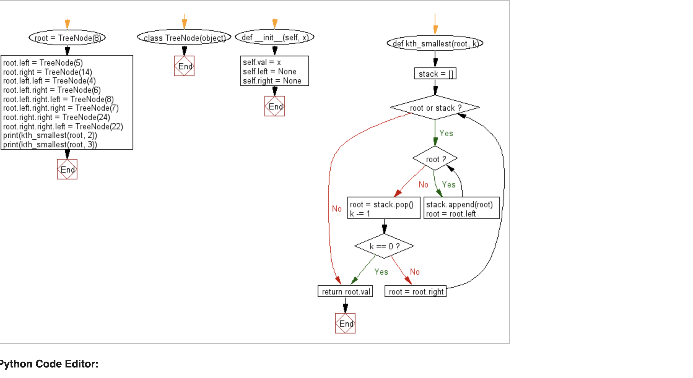

# **2 Microsoft Interview Algorithm 2021**

### **1、Find the kth smallest element in a given a binary search tree (BST)**

Write a Python program to find the kth smallest element in a given a binary search tree.

```
class TreeNode(object):
    def __init__(self, x):
        self.val = x
        self.left = None
        self.right = None

def kth_smallest(root, k):
    stack = []
    while root or stack:
        while root:
            stack.append(root)
            root = root.left
        root = stack.pop()
        k -= 1
        if k == 0:
            break
        root = root.right
    return root.val

root = TreeNode(8)  
root.left = TreeNode(5)  
root.right = TreeNode(14) 
root.left.left = TreeNode(4)  
root.left.right = TreeNode(6) 
root.left.right.left = TreeNode(8)  
root.left.right.right = TreeNode(7)  
root.right.right = TreeNode(24) 
root.right.right.left = TreeNode(22)  

print(kth_smallest(root, 2))
print(kth_smallest(root, 3))
```

```
5
8
```




## **2、最长公共前缀**

编写一个函数来查找字符串数组中的最长公共前缀。


如果不存在公共前缀，返回空字符串 ""。

```
示例 1:

输入: ["flower","flow","flight"]
输出: "fl"
示例 2:

输入: ["dog","racecar","car"]
输出: ""
解释: 输入不存在公共前缀。
说明:

所有输入只包含小写字母 a-z 。
```


利用python中的`zip()`函数，**取列表上每个字符串上每一个位的字母，比较同一位置上的字母是否相同来计算最长的公共前缀**。

```
names = ['Bruce', 'Clark', 'Peter', 'Logan', 'Wade']
heros = ['Batman', 'Superman', 'Spiderman', 'Wolverine', 'Deadpool']
print(list(zip(names, heros)))

# {'Bruce': 'Batman', 'Clark': 'Superman', 'Peter': 'Spiderman', 'Logan': 'Wolverine', 'Wade': 'Deadpool'}

```
```
def longest_string(arr):
    result = ""
    for i in zip(*arr):
        if len(set(i)) == 1:
            result += i[0]
        else:
            break
    return result

arr = ["a","ab","abc"]
print(longest_string(arr))
```

`*arr`: all arr 


**取列表中第一个字符串s0，遍历后序字符串，看s0与字符串相同的最长前缀是多少。**

```
def longest_str(str):
    if not str:
        return ""
    res = str[0]
    i = 1
    while i < len(str):
        while str[i].find(res) != 0:
            res = res[0:len(res)-1]
        i += 1
    return res

print(longest_str(["aabc","ab"]))
```

```
$ python3 a2.py 
ab
```

## **3、两数之和 Two Sum**


给定一个整数数组 nums 和一个目标值 target，请你在该数组中找出和为目标值的那 两个 整数，并返回他们的数组下标。

你可以假设每种输入只会对应一个答案。但是，你不能重复利用这个数组中同样的元素。

示例:

```
给定 nums = [2, 7, 11, 15], target = 9
因为 nums[0] + nums[1] = 2 + 7 = 9
所以返回 [0, 1]
```

### **3-1 关于Python的`enumerate()`的用法**

```
a = [3,4,5,6]
for i, num in a:
    print(i, num)
```

**`TypeError: 'int' object is not iterable`**

```
a = [3,4,5,6]
for i, num in enumerate(a):
    print(i, num)
```
```
(0, 3)
(1, 4)
(2, 5)
(3, 6
```

```
def twoSum(nums, target):
    """
    :type nums: List[int]
    :type target: int
    :rtype: List[int]
    """
    idxDict = dict()
    for idx, num in enumerate(nums):
        if target - num in idxDict:
            return [idxDict[target - num], idx]
        idxDict[num] = idx


nums = [2, 7, 11, 15]
target = 9

print(twoSum(nums,target))
```


