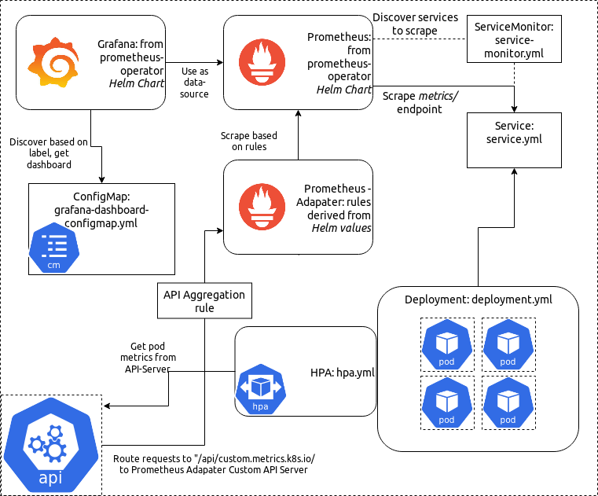

# **7 Tesla** 

[Instrumenting Ruby on Rails with Prometheus](https://firehydrant.io/blog/instrumenting-ruby-on-rails-with-prometheus/)

[How To Use Prometheus Adapter to Autoscale Custom Metrics Deployments](https://hackernoon.com/how-to-use-prometheus-adapter-to-autoscale-custom-metrics-deployments-p1p3tl0)

### **The technical problem**

Setup **customizatized** automatically HPA(horizontal Pod AutoScaler) infrastructure for our web application server pods based on a large amount of web server quests during a short of times. 

Our web application is running with Nginx server inside Kubernetes pod, we want to set up an automatically scaling up/down policy based on customized NGINX metrics for example when a large amount of requests come, we want our web application server will automatically scaling up and scaling down when requests dropping in the session of time.

Default Kubernetes HPA policies are only based on CPU and memory. 
We already installed Prometheus operator inside our cluster as our monitor tool, so I choose nginx-prometheus-exporter to export nignx service metrics, Prometheus scrape metrics from services, and prometheus-adpater pull metrics and APIServer expose metrics to be used by Horizontal Pod Autoscaling object.

### **Why was it hard?**

Normally we only use Prometheus/Granfana as monitor solutions and only use CPU and Memory to scale the deployment. How to combine two solutions to enable HPA inside the Kubernetes cluster needs strong experience on both Prometheus and Kubernetes, and the Prometheus-adapter is pretty complex

### **How did solve it?**

  
Inject `nginx-prometheus-exporter` as sidecar inside the web application pod to export niginx metrics to Prometheus, use `nginx_http_requests_total` as HPA metrics. And make sure Prometheus can collect all these nginx metrics.

Config Prometheus adapter configmap for the metrics, like seriesQuery: `nginx_http_requests_total`, and create Prometheus adapater deployment, service and APIService

Create Kubernetes HorizontalPodAutoscaler(HPA) to set up HPA policy based on the metrics name created by Prometheus adapter and we can also set up target value for the scaling up/down threshold.

Then the Kubernetes API server will route the request to the Prometheus adapter custom API server to trigger the scaling actions.

### **What alternative solutions did you consider and why didn't you choose them?**

KEDA is a Kubernetes-based Event Driven Autoscaler. KEDA can drive the scaling of any container in Kubernetes based on the number of events needing to be processed.

KEDA main component Scaler represents event sources that KEDA can scale based on a queue services like AWS Kinesis Stream, Kafka topic, RabbiqMQ queue, Redis Streams. 

So this solution is better for backend services like queue consumers to do the SQL query job and need to set up another set **metrics adapter, contoller and Scaler** not perfect for front-end web service or web server as loadbalancer.

