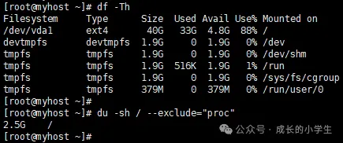
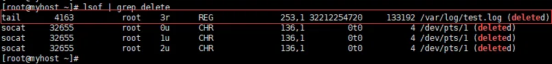
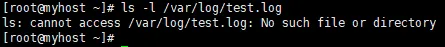
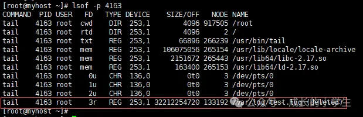
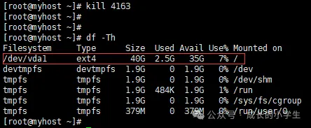

# df命令显示磁盘空间不足而du命令显示还有很多空闲空间


使用df命令可以看到磁盘使用率很高，本想使用du命令找出大文件并进行删除时，但发现各个目录文件的大小相加，并没有占满磁盘。如下图所示：

```
df -Th
du -sh / --exclude="proc"
```




**使用df命令查看到根(/)目录使用到33G，而du命令显示只使用了2.5G。**

### 1. 关于df与du命令

首先了解一下两个命令的不同之处，

**df主要用于查看整个文件系统的磁盘空间占用情况，而du则用于查看文件和目录的磁盘使用空间。**

df命令：显示的是文件系统级别的磁盘空间使用情况，包括已用空间、可用空间以及挂载点等信息。

通过df命令，可以得知各个分区的总空间、已用空间和剩余空间，从而了解磁盘的使用状况。


**du命令：du更侧重于展示文件和目录级别的磁盘占用情况，只计算文件或目录占用的磁盘空间。这个命令通常用来查找占用空间大的文件或者目录，帮助我们定位可能的磁盘空间浪费问题。**

### 2. 问题原因

因为虽然文件已被删除，使用ls命令无法找到，但是如果有进程占用该文件时，磁盘空间并不会得到释放。正因为如此，使用df命令查看磁盘使用率时，这些已删除未释放的文件会被统计到，而du只统计未删除的文件，从而导致两者的结果相关较大

### 3. 处理方法

使用 lsof 命令可以显示已删除的文件，将有问题的进程/服务重启，磁盘空间就会得到释放。

如果没有lsof命令，则进行安装。

```
yum install lsof -y
```

#### 3.1 查看已删除但未释放的文件

```
lsof | grep delete
```



此时可以看到`/var/log/test.log`文件已经删除，但还在被tail命令占用，占用文件的进程ID可以看到是4163；

在使用ls命令时，已经查看不到该文件了：

```
ls -l /var/log/test.log
```



根据进程ID也可以看到该文件：

```
lsof -p 4163
```



#### 3.2 关闭进程并验证

```
kill 4163
```



将异常进程关闭后，使用df命令查看磁盘空间时显示结果正常。

注意：这里需要自行判断是否为异常进程，以及了解进程被关闭后如何启动。